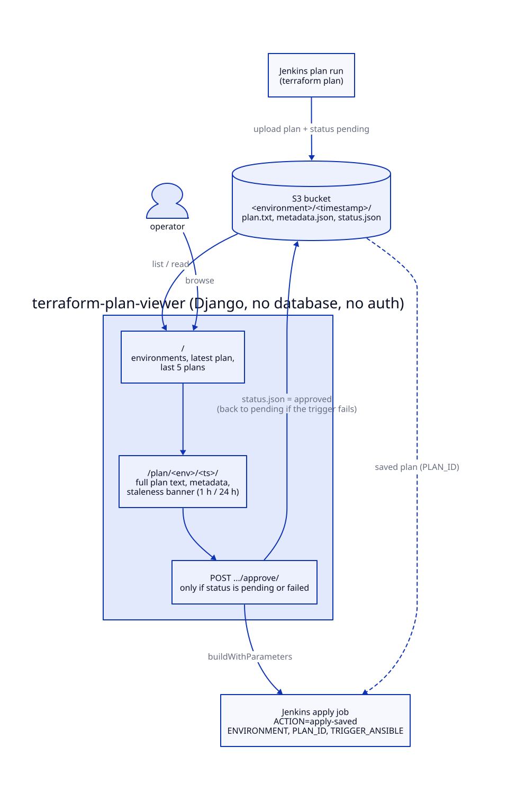

# terraform-plan-viewer

A small Django web UI that closes the loop on a "plan in CI, approve by a human,
apply the exact saved plan" Terraform workflow. A CI job runs `terraform plan`
and uploads the plan to S3. This app lists the plans for each environment, shows
the full plan output and how stale it is, and on approval triggers a Jenkins job
to apply that saved plan.

It comes from a working homelab. The bucket, job, host and account names here
are placeholders.

## How it works



Each plan run writes one folder to the bucket:

```
s3://<bucket>/<environment>/<timestamp>/
  plan.txt        terraform show output
  metadata.json   {"timestamp", "git_commit", "build_number", ...}
  status.json     {"status": "pending", "created_at", "updated_at"}
```

Routes:

- `/`: environments, the latest plan and the last 5 plans for each.
- `/plan/<env>/<ts>/`: full plan text, metadata and a staleness banner.
- `POST /plan/<env>/<ts>/approve/`: sets `status.json` to `approved` and calls
  Jenkins `buildWithParameters` with `ACTION=apply-saved`,
  `ENVIRONMENT=<env>`, `PLAN_ID=<env>/<ts>` and `TRIGGER_ANSIBLE=true|false`.
  If the trigger fails, the status goes back to `pending`.
- `/health/`: liveness/readiness probe.

Notes:

- **No database.** S3 is the only state. Top-level prefixes are environments.
  A prefix or plan folder named `latest` is ignored.
- **Staleness.** A plan older than 1 h gets a warning and older than 24 h a
  critical banner (`STALENESS_WARNING` / `STALENESS_CRITICAL` in settings),
  because a saved plan applies against whatever state exists at apply time.
- Only plans in `pending` or `failed` state can be approved.
- The Jenkins job on the other side must accept those four parameters and do
  the apply. It is not part of this repo.

## Configuration

All configuration is environment variables (see `viewer/settings.py`):

| Variable | Purpose |
|---|---|
| `S3_BUCKET`, `S3_REGION` | where plans live |
| `AWS_ACCESS_KEY_ID`, `AWS_SECRET_ACCESS_KEY` | S3 read + `PutObject` on `*/status.json` (or any boto3 credential source) |
| `JENKINS_URL`, `JENKINS_USER`, `JENKINS_TOKEN`, `JENKINS_JOB` | apply trigger (API token, not password) |
| `DJANGO_SECRET_KEY`, `DJANGO_DEBUG`, `DJANGO_ALLOWED_HOSTS` | Django basics |

## Running

Local:

```bash
python -m venv .venv && . .venv/bin/activate
pip install -r requirements.txt
cp .env.example .env && $EDITOR .env
set -a; . ./.env; set +a
python manage.py runserver
```

Container / Kubernetes:

```bash
docker build -t terraform-plan-viewer .
kubectl apply -f k8s/namespace.yaml
cp k8s/secret.yaml.example k8s/secret.yaml && $EDITOR k8s/secret.yaml   # git-ignored
kubectl apply -f k8s/secret.yaml -f k8s/deployment.yaml -f k8s/service.yaml
```

The manifests expect an image in ECR (`123456789012.dkr.ecr...` is a placeholder)
pulled with an `ecr-creds` image pull secret, and expose the app on NodePort
30082. Gunicorn serves on :8000 and WhiteNoise serves static files.

## Layout

```
viewer/            Django project (settings, urls, wsgi)
plans/
  s3_client.py     list environments/plans, read plan/metadata/status, update status
  jenkins_client.py trigger apply-saved, read job status
  views.py, urls.py
  templates/plans/ dashboard, detail, error, base (inline CSS, dark theme)
k8s/               namespace, deployment, service, secret.yaml.example
Dockerfile         python:3.11-slim, non-root, gunicorn
```

## Security notes

The app has **no authentication of its own**, and anyone who can reach it can
approve an apply. Run it only on a trusted network or behind an authenticating
reverse proxy. `CsrfViewMiddleware` is not enabled in `settings.py` (the form
emits a token but nothing checks it), so add the middleware before exposing it
more widely. Scope the AWS credentials to the plans bucket.

## Requirements

Python 3.11, Django 4.2, boto3, requests, gunicorn, whitenoise.

## License

MIT. See [LICENSE](LICENSE).
